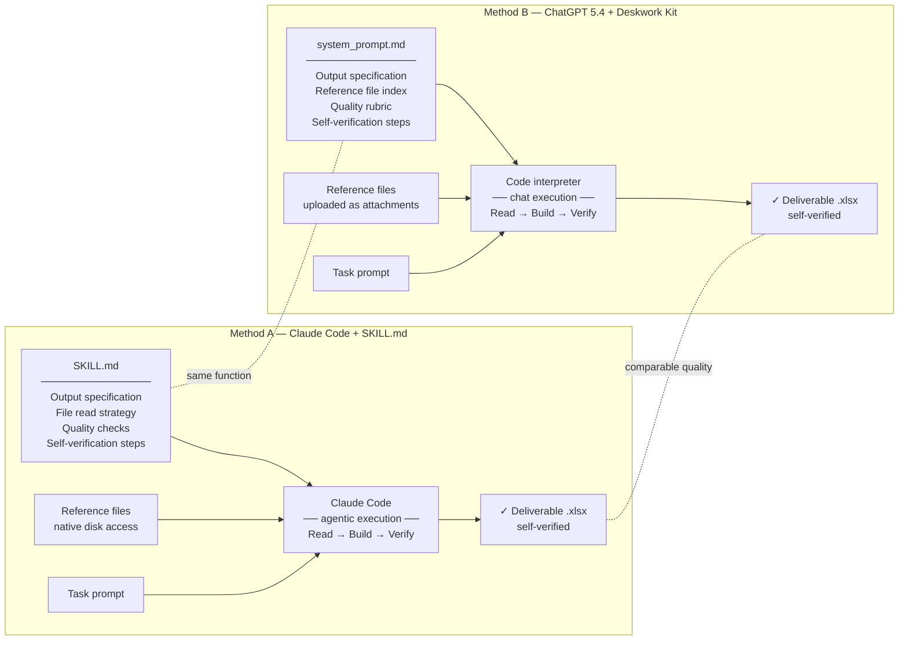

# Deskwork

> A portable workflow kit that closes the gap between one-shot LLM chat and Claude Code-level output quality on professional office tasks.

Tested on 3 tasks from the [GDPval benchmark](https://arxiv.org/abs/2510.04374) (OpenAI, 2025) — real professional tasks scored by domain experts.

---

## The claim

Frontier LLMs fail professional tasks not because they lack intelligence, but because they lack **workflow structure**. The GDPval paper identifies the dominant failure modes as instruction-following failures, file-delivery failures, and lost context — not knowledge gaps. Structured workflow scaffolding directly addresses all three.

This repo tests that claim against three methods across four professional finance and audit tasks: Claude Code with a SKILL.md spec, ChatGPT 5.4 Think Deeper with a Deskwork-generated system_prompt, and ChatGPT 5.4 Think Deeper with no system prompt at all (one-shot baseline).

---

## Benchmark results

| Task | Rubric Pts | Claude Code + SKILL.md | GPT 5.4 One-Shot | GPT 5.4 + Deskwork |
|------|:----------:|:----------------------:|:----------------:|:------------------:|
| Fall Music Tour P&L | 89 | **79 (89%)** | 75 (84%) | 76 (85%) |
| Aurisic Prepaid Amortization | 95 | 91 (96%) | **93 (98%)** | 86 (91%) |
| Anti-Financial Crime Audit Sampling | 63 | **60 (95%)** | 48 (76%) | 49 (78%) |
| Aurisic Financial Reporting (Apr 2025) | 59 | **57 (97%)** | 44 (75%) | 40 (68%) |
| **Combined (All 4 Tasks)** | **306** | **287 (94%)** | **260 (85%)** | **251 (82%)** |

All three methods ran without access to the gold-standard answer or rubric. The results reveal a more nuanced picture than the original hypothesis: Deskwork-scaffolded ChatGPT (82%) underperforms the unscaffolded one-shot baseline (85%) across all four tasks. Claude Code leads both by 9–12 percentage points, with the gap widening on high-complexity tasks. The key finding is that Claude Code's advantage does not come from a better specification document — it comes from the **agentic execution loop**: the ability to run code, observe intermediate output, and self-correct before producing the final deliverable. See [`benchmarks/results/summary.md`](benchmarks/results/summary.md) for the full analysis.

---

## Architecture

The two methods are structurally equivalent. The diagram shows how each component maps to the other:



**SKILL.md** and **system_prompt.md** serve the same function: they make the output specification, reference file map, quality checks, and verification protocol explicit before execution begins. Claude Code reads SKILL.md natively; the Deskwork kit generates an equivalent system_prompt.md that any LLM can use via chat.

---

## Repository structure

```
deskwork/
├── benchmarks/                    # The proof
│   ├── tasks/                     # GDPval task prompts + reference files
│   ├── claude-code/               # Claude Code + SKILL.md outputs
│   ├── gpt-5/                     # ChatGPT 5.4 + Deskwork outputs
│   └── results/
│       ├── comparison-notes.md    # Per-task scoring with rubric scorecard
│       └── summary.md             # Cross-task findings
│
└── deskwork-kit/                  # The product
    ├── README.md                  # How to use the kit
    ├── generate/
    │   ├── builder-prompt.md      # Paste this into any LLM to generate your workflow
    │   └── example-session.md    # Annotated walkthrough of a generation session
    └── examples/                  # Ready-to-use examples
        ├── music-tour-pl/
        └── afc-audit-sampling/
```

---

## Using the Deskwork Kit

See [deskwork-kit/README.md](deskwork-kit/README.md) for full instructions. The short version:

1. Paste [`deskwork-kit/generate/builder-prompt.md`](deskwork-kit/generate/builder-prompt.md) into any capable LLM
2. Upload your reference files and describe what you need to produce in 2–3 sentences
3. Answer the LLM's clarifying questions — it generates a `system_prompt.md` for your task
4. Open a **new chat**, paste the `system_prompt.md`, upload your files, and ask for the deliverable

The generated `system_prompt.md` encodes your output spec, reference file map, quality rubric, and self-verification protocol — everything needed for consistent, correct output.

---

## About the benchmark

Tasks are from [GDPval](https://arxiv.org/abs/2510.04374) (Patwardhan et al., OpenAI, 2025), a benchmark of 1,320 real-world professional tasks scored by domain experts averaging 14 years of experience. The three tasks used here are from the Accountants & Auditors occupation in the Professional/Scientific/Technical Services sector.

The GDPval paper's own finding: the dominant failure modes are **instruction-following failures, failed file delivery, and lost context across multi-file inputs** — not intelligence gaps. Deskwork directly addresses all three.
